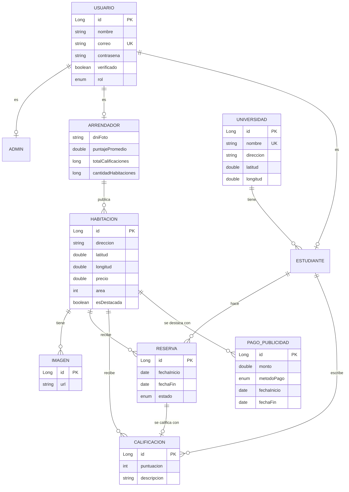
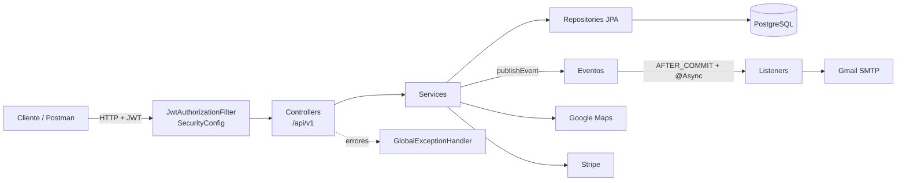
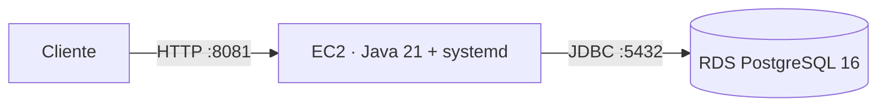

# MuvU: plataforma de alquiler de habitaciones para estudiantes universitarios cerca de su campus

**Curso:** CS 2031 Desarrollo Basado en Plataforma

**Integrantes:**
- Yerik Dylan Vega Santillan
- Cristhian Gabriel Jinchuña Cama
- Mathias Alonso Cavalcanti Estacio
- Eduardo Raúl Vila Castellares
- Mathius Edgar Quispe Sicha

---

## Índice

1. [Introducción](#1-introducción)
2. [Identificación del problema o necesidad](#2-identificación-del-problema-o-necesidad)
3. [Descripción de la solución](#3-descripción-de-la-solución)
4. [Modelo de entidades](#4-modelo-de-entidades)
5. [Arquitectura y decisiones de diseño](#5-arquitectura-y-decisiones-de-diseño)
6. [Manejo de errores](#6-manejo-de-errores)
7. [Medidas de seguridad implementadas](#7-medidas-de-seguridad-implementadas)
8. [Eventos y asincronía](#8-eventos-y-asincronía)
9. [Endpoints](#9-endpoints)
10. [Ejecución local](#10-ejecución-local)
11. [GitHub & Management](#11-github--management)
12. [Deployment](#12-deployment)
13. [Conclusión](#13-conclusión)
14. [Apéndices](#14-apéndices)

---

## 1. Introducción

### Contexto
Cada ciclo, miles de estudiantes buscan vivir cerca de su universidad. Lo hacen por grupos de Facebook, carteles o recomendaciones: la información está dispersa, no se sabe qué tan lejos queda el campus ni si el arrendador es confiable.

### Objetivos del proyecto
- Encontrar habitaciones **cerca de la universidad**, filtradas por distancia.
- Dar confianza con **arrendadores verificados** y **calificaciones** de otros estudiantes.
- Ordenar la **reserva** (solicitud, confirmación, cancelación) con avisos por correo.
- Permitir a los arrendadores **destacar** sus habitaciones mediante un pago.

## 2. Identificación del problema o necesidad

### Descripción del problema
El estudiante no puede comparar habitaciones por cercanía a su universidad, no sabe si el anuncio es real y coordina la reserva por mensajes, sin registro. El arrendador, a su vez, no tiene un canal enfocado en estudiantes.

### Justificación
La vivienda influye en el rendimiento y el gasto del estudiante. Una plataforma especializada reduce el tiempo de búsqueda y el riesgo de estafas, y da a los arrendadores una demanda constante.

## 3. Descripción de la solución

### Funcionalidades implementadas

| Rol | Funcionalidades |
|---|---|
| Visitante | Ver habitaciones (destacadas primero), buscar **habitaciones cercanas** a una universidad por radio en km, ver imágenes y reseñas |
| Estudiante | Registrarse con correo institucional (`.edu.pe`), reservar, cancelar, **calificar** reservas confirmadas y editar su perfil |
| Arrendador | Publicar y editar habitaciones (una vez **verificado**), subir imágenes, confirmar reservas, ver el perfil del estudiante y **pagar publicidad** con Stripe |
| Administrador | Verificar arrendadores, gestionar universidades y eliminar cuentas o calificaciones |
| Todos | Login con JWT, **refresh token** y **recuperación de contraseña** por correo |

La búsqueda por radio resuelve la cercanía; la verificación y las calificaciones dan confianza; las reservas con correos reemplazan la coordinación informal.

### Tecnologías utilizadas

| Área | Tecnología |
|---|---|
| Backend | Java 21, Spring Boot 4.1 (Web, Data JPA, Security, Validation, Mail, Thymeleaf) |
| Base de datos | PostgreSQL 16 (Docker en local, RDS en producción) |
| Seguridad | Spring Security, JWT (JJWT 0.12), BCrypt |
| Mapeo | ModelMapper 3.2 y Lombok |
| APIs externas | Google Maps Geocoding, Stripe (modo prueba), Gmail SMTP |
| Calidad | JUnit 5 + Mockito, JaCoCo, SLF4J + Logback |
| Herramientas | Maven, Postman, GitHub |

## 4. Modelo de entidades



### Descripción de entidades
- **Usuario** (abstracta, herencia `JOINED`): datos comunes, correo único y **rol**. Subclases: **Admin**, **Arrendador** (DNI y estadísticas que recalculan los eventos) y **Estudiante** (pertenece a una universidad).
- **Universidad**: coordenadas de referencia para la búsqueda por cercanía.
- **Habitacion**: dirección geocodificada, precio, área y si está destacada; sus **imágenes** se eliminan con ella (`cascade` + `orphanRemoval`).
- **Reserva**: une estudiante y habitación con fechas y estado (`PENDIENTE`, `CONFIRMADO`, `CANCELADO`).
- **Calificacion**: puntuación de 1 a 5, `@OneToOne` con su reserva.
- **PagoPublicidad**: destaca una habitación entre dos fechas.

Relaciones `LAZY` con `@EntityGraph` donde hace falta, índices en las llaves foráneas y validaciones en entidades y DTOs.

## 5. Arquitectura y decisiones de diseño



**Decisiones de diseño**
- **Capas** Controller → Service → Repository: los controllers validan (`@Valid`) y responden; la lógica y los permisos viven en los services.
- **26 DTOs** de request y response con ModelMapper; nunca se expone una entidad ni la contraseña.
- **JWT sin estado:** access token de 1 hora y refresh token de 7 días, con `userId`, correo y roles.
- **Roles con `@PreAuthorize`** en cada endpoint; `SecurityConfig` solo define las rutas públicas.
- **API versionada** (`/api/v1`), recursos en plural y sub-recursos para imágenes y calificaciones.
- **HATEOAS:** se consideró, pero las respuestas `201` ya incluyen `Location` y no hay un cliente que use enlaces.

## 6. Manejo de errores

Un `@RestControllerAdvice` (`GlobalExceptionHandler`) centraliza los errores y responde siempre con el mismo `ErrorResponseDTO`:

```json
{ "timestamp": "2026-09-25T10:00:00", "status": 404, "error": "Not Found",
  "message": "Habitación no encontrada con ID: 99", "path": "/api/v1/habitaciones/99" }
```

Las excepciones propias heredan de `MuvuException`, que define su código HTTP:

| Excepción | Código |
|---|---|
| `InvalidOperationException`, validaciones y JSON mal formado | 400 |
| `InvalidTokenException`, credenciales o token inválido | 401 |
| `ForbiddenException` y `@PreAuthorize` | 403 |
| `ResourceNotFoundException` | 404 |
| `ConflictException`, `DuplicateResourceException`, `ReservaInvalidStateException` | 409 |
| `ExternalServiceException`, `PaymentException` (Google Maps, Stripe) | 502 |
| Cualquier otro error | 500 (detalle solo en el log) |

Así las respuestas son consistentes y no filtran detalles internos.

## 7. Medidas de seguridad implementadas

### Seguridad de datos
- Contraseñas cifradas con **BCrypt** y con reglas de fuerza (mayúscula, minúscula, número y símbolo).
- **JWT** firmado con HMAC-SHA, validado en cada request junto con su vencimiento; un refresh token no sirve para llamar a la API.
- **Roles** con `@PreAuthorize` y verificación de **propiedad**: solo el dueño edita su habitación, confirma sus reservas o paga su publicidad.
- Secretos en **variables de entorno**; el `.env` está en `.gitignore`.

### Prevención de vulnerabilidades
- **Inyección SQL:** todo el acceso a datos es con Spring Data JPA y consultas parametrizadas.
- **XSS:** la API solo responde JSON, y la plantilla de correo usa `th:text`, que escapa el contenido.
- **CSRF:** desactivado a propósito: la API es *stateless* y usa tokens en el header, no cookies.
- **CORS:** solo se aceptan los orígenes configurados en `CORS_ALLOWED_ORIGINS`.
- **Enumeración de usuarios:** la recuperación de contraseña responde igual exista o no el correo.
- **Datos sensibles:** la lista de estudiantes solo la ve el administrador.

## 8. Eventos y asincronía

| Evento | Se publica al | Qué hace |
|---|---|---|
| `NotificacionCorreoEvent` | Registro, verificación, reservas, pago de publicidad, recuperación de contraseña | Envía un correo HTML con plantilla Thymeleaf |
| `ActualizacionPromedioEvent` | Crear o eliminar una calificación | Recalcula el promedio del arrendador |
| `ActualizacionHabitacionesEvent` | Crear o eliminar una habitación | Recalcula sus habitaciones publicadas |

Los listeners usan `@TransactionalEventListener(AFTER_COMMIT)` y `@Async`: solo se ejecutan si la operación se guardó, en un pool propio (`ThreadPoolTaskExecutor`, hilos `muvu-async-*`). **Son asíncronos** porque un correo puede tardar segundos y el usuario no debe esperarlo; si falla, queda en el log sin afectar la operación. Además desacoplan los services: `ReservaService` no sabe cómo se envían los correos.

## 9. Endpoints

Base: `/api/v1`. Las rutas protegidas usan `Authorization: Bearer <token>`. Los listados (`/habitaciones`, `/habitaciones/cercanas`, `/reservas`, `/estudiantes` y las calificaciones) son **paginados** con `page` y `size`.

| Recurso | Endpoints principales | Acceso |
|---|---|---|
| Auth | `POST /auth/register/estudiante`, `/auth/register/arrendador`, `/auth/login`, `/auth/refresh`, `/auth/forgot-password`, `/auth/reset-password` | Público |
| Habitaciones | `GET /habitaciones`, `/habitaciones/{id}`, `/habitaciones/cercanas` · `POST`, `PUT`, `DELETE` | Público / Arrendador dueño |
| Imágenes y calificaciones | `/habitaciones/{id}/imagenes`, `/habitaciones/{id}/calificaciones`, `/estudiantes/{id}/calificaciones`, `POST /calificaciones` | Público / Arrendador / Estudiante |
| Reservas | `GET`, `POST /reservas` · `PATCH /reservas/{id}/cancelar` · `PATCH /reservas/{id}/confirmar` | Estudiante / Arrendador dueño |
| Arrendadores y estudiantes | `GET`, `PUT`, `DELETE /{id}` · `PATCH /arrendadores/{id}/verificar` (Admin) · `GET /estudiantes/{id}/perfil` | Autenticado |
| Universidades | `GET` (público) · `POST`, `DELETE` (Admin) | Público / Admin |
| Pagos de publicidad | `POST /pagos-publicidad` (30 = 30 días, 54 = 60 días), `GET /pagos-publicidad` | Arrendador |

La colección [`postman_collection.json`](postman_collection.json) documenta cada endpoint con descripción, ejemplos y autorización.

## 10. Ejecución local

1. **Base de datos:** `cd desarrollo && docker compose up -d` (PostgreSQL en el puerto 5433).
2. **Variables de entorno:** copiar `desarrollo/.env.example` a `desarrollo/.env` y completar:

| Variable | Uso |
|---|---|
| `JWT_SECRET` | Firma de los tokens (mínimo 32 caracteres) |
| `GOOGLE_MAPS_API_KEY`, `STRIPE_SECRET_KEY` | Geocodificación y pagos de prueba |
| `MAIL_USERNAME`, `MAIL_PASSWORD` | Gmail y su contraseña de aplicación |
| `DB_URL`, `DB_USERNAME`, `DB_PASSWORD`, `PORT` | Opcionales en local; se usan en producción |
| `JWT_*_EXPIRATION`, `CORS_ALLOWED_ORIGINS` | Opcionales, con valores por defecto |

3. **Ejecutar:** `./mvnw spring-boot:run` desde `desarrollo/` → `http://localhost:8081/api/v1`.
4. **Pruebas:** `./mvnw test`; el reporte de JaCoCo queda en `target/site/jacoco`.

`data.sql` carga datos de prueba. Usuarios: `admin@muvu.com` / `admin123` (Admin); `rosa.quispe@muvu.com` y `ana.ramos@utec.edu.pe` / `Clave123!` (arrendadora y estudiante).

## 11. GitHub & Management

- **Gestión de tareas:** se usaron **GitHub Issues** para repartir el trabajo; cada issue tiene un responsable asignado y labels (por ejemplo `enhancement`).
- **Control de versiones:** cada funcionalidad o corrección se trabajó en su propia rama y se integró a `main` mediante **pull requests** (más de 50).
- **GitHub Actions:** no se configuró un pipeline; antes de cada pull request se ejecutaban `./mvnw test` y la colección de Postman. Un CI/CD con tests, cobertura y despliegue automático queda como trabajo futuro.

## 12. Deployment

El backend está desplegado en **AWS** con EC2 y RDS:



- **URL pública:** `http://<IP-ELASTICA>:8081/api/v1`
- **EC2:** ejecuta el `.jar` como servicio `systemd`, que lo reinicia si falla.
- **RDS:** PostgreSQL 16 sin acceso público.
- **Security groups:** EC2 abre el puerto 8081 al público y el 22 (SSH) solo con llave; RDS abre el 5432 únicamente al security group de EC2.
- **Variables de entorno en producción:** se definen en el servidor (`/etc/muvu.env`), nunca en el repositorio: `DB_URL`, `DB_USERNAME`, `DB_PASSWORD`, `JWT_SECRET`, `STRIPE_SECRET_KEY`, `GOOGLE_MAPS_API_KEY`, `MAIL_USERNAME` y `MAIL_PASSWORD`.

## 13. Conclusión

### Logros del proyecto
MuvU cubre el ciclo completo de alquiler: búsqueda por cercanía, verificación, reservas, calificaciones y publicidad pagada, con correos automáticos, en una API segura y documentada.

### Aprendizajes clave
- Modelar herencia y relaciones *lazy* sin consultas N+1.
- Separar responsabilidades con DTOs, services y manejo global de errores.
- Autenticación sin estado con JWT, refresh tokens y roles.
- Eventos asíncronos y trabajo en equipo con ramas y pull requests.

### Trabajo futuro
Frontend web y móvil, chat entre estudiante y arrendador, pago del alquiler en la plataforma, subida de imágenes a S3, filtros por precio, documentación con Swagger/OpenAPI y CI/CD con GitHub Actions.

## 14. Apéndices

### Licencia
Distribuido bajo la licencia **MIT** (ver [LICENSE](LICENSE)).

### Referencias
- Spring Boot: https://docs.spring.io/spring-boot/
- Spring Security: https://docs.spring.io/spring-security/reference/
- JJWT: https://github.com/jwtk/jjwt
- Google Maps Geocoding API: https://developers.google.com/maps/documentation/geocoding
- Stripe API: https://docs.stripe.com/api
- Thymeleaf: https://www.thymeleaf.org/documentation.html
