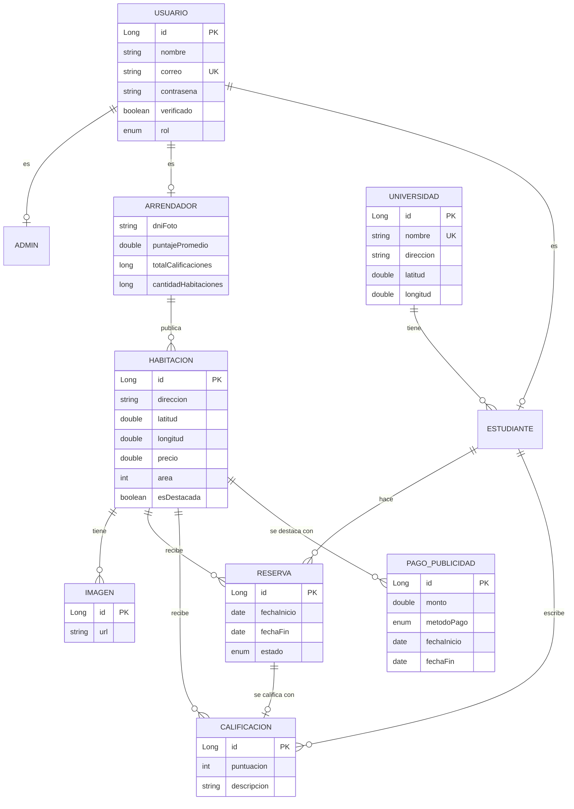
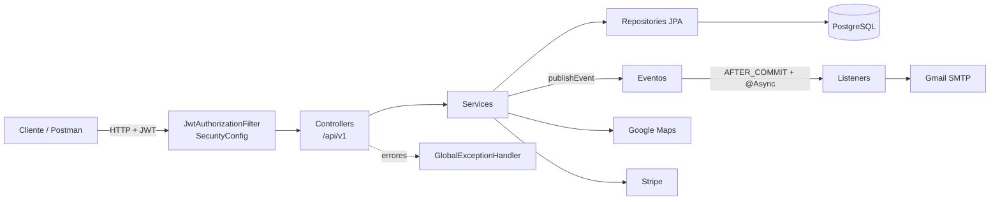

# MuvU: plataforma de alquiler de habitaciones para estudiantes universitarios cerca de su campus

**Curso:** CS 2031 Desarrollo Basado en Plataforma

**Integrantes:**
- Yerik Dylan Vega Santillan
- Cristhian Gabriel Jinchuña Cama
- Mathias Alonso Cavalcanti Estacio
- Eduardo Raúl Vila Castellares
- Mathius Edgar Quispe Sicha

---

## Índice

1. [Introducción](#1-introducción)
2. [Identificación del problema o necesidad](#2-identificación-del-problema-o-necesidad)
3. [Descripción de la solución](#3-descripción-de-la-solución)
4. [Modelo de entidades](#4-modelo-de-entidades)
5. [Arquitectura y decisiones de diseño](#5-arquitectura-y-decisiones-de-diseño)
6. [Manejo de errores](#6-manejo-de-errores)
7. [Medidas de seguridad implementadas](#7-medidas-de-seguridad-implementadas)
8. [Eventos y asincronía](#8-eventos-y-asincronía)
9. [Endpoints](#9-endpoints)
10. [Ejecución local](#10-ejecución-local)
11. [GitHub & Management](#11-github--management)
12. [Deployment](#12-deployment)
13. [Conclusión](#13-conclusión)
14. [Apéndices](#14-apéndices)

---

## 1. Introducción

### Contexto
Cada ciclo, miles de estudiantes se mudan a Lima o buscan vivir más cerca de su universidad. La búsqueda se hace por grupos de Facebook, carteles o recomendaciones: la información está dispersa, no se sabe qué tan lejos queda el campus y no hay forma de saber si el arrendador es confiable.

### Objetivos del proyecto
- Permitir que un estudiante encuentre habitaciones **cerca de su universidad**, filtradas por distancia.
- Dar confianza con **arrendadores verificados** por un administrador y **calificaciones** de estudiantes que ya se alojaron.
- Ordenar el proceso de **reserva** (solicitud, confirmación y cancelación) con notificaciones por correo.
- Ofrecer a los arrendadores un canal para **destacar** sus habitaciones mediante un pago.

## 2. Identificación del problema o necesidad

### Descripción del problema
El estudiante no puede comparar habitaciones por cercanía a su universidad, no sabe si el anuncio es real y coordina la reserva por mensajes, sin registro. El arrendador, a su vez, no tiene un canal enfocado en estudiantes.

### Justificación
La vivienda influye en el rendimiento y el gasto de los estudiantes. Una plataforma especializada reduce el tiempo de búsqueda, disminuye el riesgo de estafas con verificación y reseñas, y da a los arrendadores una demanda constante.

## 3. Descripción de la solución

### Funcionalidades implementadas

| Rol | Funcionalidades |
|---|---|
| Visitante | Ver habitaciones (destacadas primero), buscar **habitaciones cercanas** a una universidad por radio en km, ver imágenes y reseñas |
| Estudiante | Registrarse con correo institucional (`.edu.pe`), reservar, cancelar, **calificar** reservas confirmadas y editar su perfil |
| Arrendador | Publicar y editar habitaciones (una vez **verificado**), subir imágenes, confirmar reservas, ver el perfil del estudiante y **pagar publicidad** con Stripe |
| Administrador | Verificar arrendadores, gestionar universidades y eliminar cuentas o calificaciones |
| Todos | Login con JWT, **refresh token** y **recuperación de contraseña** por correo |

La búsqueda por radio resuelve la cercanía, la verificación y las calificaciones generan confianza, y la reserva con estados y correos reemplaza la coordinación informal.

### Tecnologías utilizadas

| Área | Tecnología |
|---|---|
| Lenguaje y framework | Java 21, Spring Boot 4.1 (Web MVC, Data JPA, Security, Validation, Mail, Thymeleaf) |
| Base de datos | PostgreSQL 16 en Docker, Hibernate 7 |
| Seguridad | Spring Security, JWT (JJWT 0.12), BCrypt |
| Mapeo | ModelMapper 3.2 y Lombok |
| APIs externas | Google Maps Geocoding (coordenadas), Stripe (pagos en modo prueba), Gmail SMTP (correos) |
| Calidad | JUnit 5 + Mockito, JaCoCo, SLF4J + Logback |
| Herramientas | Maven, Postman, GitHub |

## 4. Modelo de entidades



### Descripción de entidades
- **Usuario** (abstracta, herencia `JOINED`): datos comunes y el **rol** (`ESTUDIANTE`, `ARRENDADOR`, `ADMIN`). El correo es único. Sus subclases son **Admin**, **Arrendador** (foto del DNI y estadísticas que recalculan los eventos) y **Estudiante** (pertenece a una universidad).
- **Universidad**: nombre único y coordenadas, que son la referencia para la búsqueda por cercanía.
- **Habitacion**: dirección geocodificada, precio, área y si está destacada. Pertenece a un arrendador; sus **imágenes** se eliminan con ella (`cascade` + `orphanRemoval`).
- **Reserva**: une estudiante y habitación con fechas y estado (`PENDIENTE`, `CONFIRMADO`, `CANCELADO`).
- **Calificacion**: puntuación de 1 a 5, con relación `@OneToOne` a su reserva (una reseña por reserva).
- **PagoPublicidad**: pago que destaca una habitación entre dos fechas.

Todas las relaciones son `LAZY`, con `@EntityGraph` donde se necesitan para evitar consultas N+1. Hay índices en las llaves foráneas y validaciones (`@NotBlank`, `@Email`, `@Size`, `@Min`/`@Max`) en entidades y DTOs.

## 5. Arquitectura y decisiones de diseño



**Decisiones de diseño**
- **Capas** Controller → Service → Repository. Los controllers solo reciben, validan (`@Valid`) y responden; la lógica y los permisos están en los services.
- **DTOs** de request y response separados (26 DTOs) con ModelMapper. Nunca se expone una entidad ni la contraseña.
- **JWT sin estado:** un access token de 1 hora y un refresh token de 7 días. El token incluye `userId`, correo y roles.
- **Roles con `@PreAuthorize`** en cada endpoint; en `SecurityConfig` solo quedan las rutas públicas.
- **API versionada** (`/api/v1`) con recursos en plural, y sub-recursos para imágenes y calificaciones.
- **Eventos después del commit:** el correo o las estadísticas no se procesan si la operación falla.
- **HATEOAS:** se consideró, pero no se implementó. Las respuestas `201` incluyen el header `Location`, y agregar enlaces en todas las respuestas complicaba los DTOs sin un cliente que los usara.

## 6. Manejo de errores

Un `@RestControllerAdvice` (`GlobalExceptionHandler`) centraliza todos los errores y responde siempre con el mismo `ErrorResponseDTO`:

```json
{ "timestamp": "2026-09-25T10:00:00", "status": 404, "error": "Not Found",
  "message": "Habitación no encontrada con ID: 99", "path": "/api/v1/habitaciones/99" }
```

Las excepciones propias heredan de `MuvuException`, que define su código HTTP:

| Excepción | Código |
|---|---|
| `InvalidOperationException` y errores de validación, JSON mal formado o parámetros | 400 |
| `InvalidTokenException`, credenciales o token inválido | 401 |
| `ForbiddenException` y `@PreAuthorize` | 403 |
| `ResourceNotFoundException` | 404 |
| `ConflictException`, `DuplicateResourceException`, `ReservaInvalidStateException` | 409 |
| `ExternalServiceException`, `PaymentException` (Google Maps, Stripe) | 502 |
| Cualquier otro error | 500 (el detalle solo se registra en el log) |

Manejarlos globalmente da respuestas consistentes, no filtra detalles internos y le dice al cliente qué corregir.

## 7. Medidas de seguridad implementadas

### Seguridad de datos
- Contraseñas cifradas con **BCrypt** y validadas como contraseñas fuertes (mayúscula, minúscula, número y símbolo).
- **JWT** firmado con HMAC-SHA y validado en cada request, incluido su vencimiento. Un refresh token no sirve para llamar a la API.
- **Roles** con `@PreAuthorize` y verificación de **propiedad** en los services: solo el dueño edita su habitación, confirma sus reservas o paga su publicidad.
- Secretos (JWT, Stripe, Google Maps, Gmail) en **variables de entorno**; el `.env` está en `.gitignore`.

### Prevención de vulnerabilidades
- **Inyección SQL:** todo el acceso a datos es con Spring Data JPA y consultas parametrizadas.
- **XSS:** la API solo responde JSON, y la plantilla de correo usa `th:text`, que escapa el contenido.
- **CSRF:** está desactivado a propósito, porque la API es *stateless* y usa tokens en el header en lugar de cookies.
- **CORS:** solo se aceptan los orígenes configurados en `CORS_ALLOWED_ORIGINS`.
- **Enumeración de usuarios:** "olvidé mi contraseña" responde igual exista o no el correo.
- **Datos sensibles:** los DTOs nunca devuelven la contraseña, y la lista de estudiantes solo la ve el administrador.

## 8. Eventos y asincronía

| Evento | Se publica al | Qué hace |
|---|---|---|
| `NotificacionCorreoEvent` | Registrarse, verificar un arrendador, crear/confirmar/cancelar una reserva, pagar publicidad, recuperar la contraseña | Envía un correo HTML con la plantilla Thymeleaf |
| `ActualizacionPromedioEvent` | Crear o eliminar una calificación | Recalcula el puntaje promedio del arrendador |
| `ActualizacionHabitacionesEvent` | Crear o eliminar una habitación | Recalcula la cantidad de habitaciones del arrendador |

Los listeners usan `@TransactionalEventListener(AFTER_COMMIT)` y `@Async`: se ejecutan solo si la operación se guardó, en un pool propio (`ThreadPoolTaskExecutor`, hilos `muvu-async-*`). **Deben ser asíncronos** porque enviar un correo puede tardar segundos y el usuario no debe esperarlo. Si un correo falla, se registra en el log sin afectar la operación. Los eventos también desacoplan los services: `ReservaService` no sabe cómo se envían los correos.

## 9. Endpoints

Base: `http://localhost:8081/api/v1`. Las rutas protegidas usan el header `Authorization: Bearer <token>`.

| Recurso | Endpoints | Acceso |
|---|---|---|
| Auth | `POST /auth/register/estudiante`, `/auth/register/arrendador`, `/auth/login`, `/auth/refresh`, `/auth/forgot-password`, `/auth/reset-password` | Público |
| Habitaciones | `GET /habitaciones`, `/habitaciones/{id}`, `/habitaciones/cercanas?universidadId=&radioKm=` | Público |
| | `POST /habitaciones`, `PUT` y `DELETE /habitaciones/{id}` | Arrendador dueño |
| Imágenes | `GET /habitaciones/{id}/imagenes` · `POST` (dueño) · `DELETE /imagenes/{id}` (dueño) | Público / Arrendador |
| Calificaciones | `GET /habitaciones/{id}/calificaciones` (público), `GET /estudiantes/{id}/calificaciones`, `GET /calificaciones/{id}` | Público / Autenticado |
| | `POST /calificaciones` · `DELETE /calificaciones/{id}` | Estudiante / Autor o Admin |
| Reservas | `GET /reservas`, `GET /reservas/{id}` | Estudiante o arrendador involucrado |
| | `POST /reservas`, `PATCH /reservas/{id}/cancelar` · `PATCH /reservas/{id}/confirmar` | Estudiante / Arrendador dueño |
| Arrendadores | `GET /arrendadores/{id}` · `PUT` (el propio) · `PATCH /{id}/verificar` (Admin) · `DELETE` (el propio o Admin) | Autenticado |
| Estudiantes | `GET /estudiantes` (Admin) · `GET /{id}` · `PUT` (el propio) · `GET /{id}/perfil` (Arrendador) · `DELETE` (el propio o Admin) | Autenticado |
| Universidades | `GET /universidades`, `/{id}` (público) · `POST`, `DELETE` (Admin) | Público / Admin |
| Pagos de publicidad | `POST /pagos-publicidad` (30 = 30 días, 54 = 60 días), `GET /pagos-publicidad` | Arrendador |

La colección [`postman_collection.json`](postman_collection.json) documenta cada endpoint con descripción, ejemplos y autorización por carpeta.

## 10. Ejecución local

1. **Base de datos:** `cd desarrollo && docker compose up -d` (PostgreSQL en el puerto 5433).
2. **Variables de entorno:** copia `desarrollo/.env.example` a `desarrollo/.env` y complétalo:

| Variable | Uso |
|---|---|
| `JWT_SECRET` | Firma de los tokens (mínimo 32 caracteres) |
| `JWT_EXPIRATION`, `JWT_REFRESH_EXPIRATION`, `JWT_RESET_EXPIRATION` | Duración en ms del access token, el refresh token y el token de recuperación (opcionales) |
| `GOOGLE_MAPS_API_KEY` | Geocodificar direcciones |
| `STRIPE_SECRET_KEY` | Clave de prueba (`sk_test_...`) |
| `MAIL_USERNAME`, `MAIL_PASSWORD` | Cuenta de Gmail y su contraseña de aplicación |
| `CORS_ALLOWED_ORIGINS` | Frontends permitidos (opcional) |
| `DB_USERNAME`, `DB_PASSWORD` | Credenciales de la base de datos (opcional, por defecto `postgres`) |

3. **Ejecutar:** `./mvnw spring-boot:run` desde `desarrollo/`. La API queda en `http://localhost:8081/api/v1`.
4. **Pruebas:** `./mvnw test` (pruebas unitarias con Mockito; el reporte de cobertura de JaCoCo queda en `target/site/jacoco`).

Al arrancar, `data.sql` carga datos de prueba: 11 universidades, 50 habitaciones, 30 imágenes, 16 reservas, 8 calificaciones y 15 pagos.

| Usuario | Contraseña | Rol |
|---|---|---|
| `admin@muvu.com` | `admin123` | Admin |
| `rosa.quispe@muvu.com` (y 4 más, verificados) | `Clave123!` | Arrendador |
| `pedro.salas@muvu.com` (sin verificar) | `Clave123!` | Arrendador |
| `ana.ramos@utec.edu.pe` (y 7 más) | `Clave123!` | Estudiante |

## 11. GitHub & Management

- **Gestión de tareas:** se usaron **GitHub Issues** (20 issues, la mayoría asignados a un integrante y algunos con el label `enhancement`).
- **Control de versiones:** cada funcionalidad o corrección se trabajó en su propia rama y se integró a `main` mediante **pull requests** (más de 50).
- **GitHub Projects:** _Pendiente._
- **GitHub Actions:** _Pendiente._

## 12. Deployment

_Pendiente._

## 13. Conclusión

### Logros del proyecto
MuvU cubre el ciclo completo de alquiler: búsqueda por cercanía, verificación de arrendadores, reservas, calificaciones y publicidad pagada, con notificaciones por correo. La API es segura, consistente en sus errores y está documentada en Postman.

### Aprendizajes clave
- Modelar datos con herencia y relaciones *lazy* sin consultas N+1.
- Separar responsabilidades con DTOs, services y un manejo global de errores.
- Autenticación sin estado con JWT, refresh tokens y roles.
- Eventos y asincronía para no bloquear al usuario.
- Trabajo en equipo con ramas y pull requests.

### Trabajo futuro
Frontend web y móvil, chat entre estudiante y arrendador, pago del alquiler en la plataforma, subida de imágenes a la nube, filtros por precio y documentación con Swagger/OpenAPI.

## 14. Apéndices

### Licencia
_Pendiente._

### Referencias
- Spring Boot: https://docs.spring.io/spring-boot/
- Spring Security: https://docs.spring.io/spring-security/reference/
- JJWT: https://github.com/jwtk/jjwt
- Google Maps Geocoding API: https://developers.google.com/maps/documentation/geocoding
- Stripe API: https://docs.stripe.com/api
- Thymeleaf: https://www.thymeleaf.org/documentation.html
